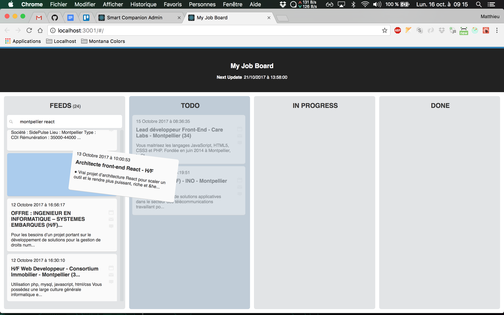

# MY JOB BOARD

[](https://travis-ci.org/sixertoy/my-job-board)
[](https://app.netlify.com/sites/objective-kalam-714036/deploys)

**demo**
http://sixertoy.github.io/my-job-board

> A Kanban application made with Electron to help in job search



## Installation

```bash
git clone https://github.com/sixertoy/my-job-board.git
cd my-job-board
yarn install
```

## Development

```bash
yarn dev
```

## APIs

**Pole Emploi**

- https://www.emploi-store-dev.fr/
- https://www.codeur.com
- https://www.jobijoba.com/fr/rss?what=react
- http://www.indeed.fr/rss?q=%28javascript%29&l=Montpellier
